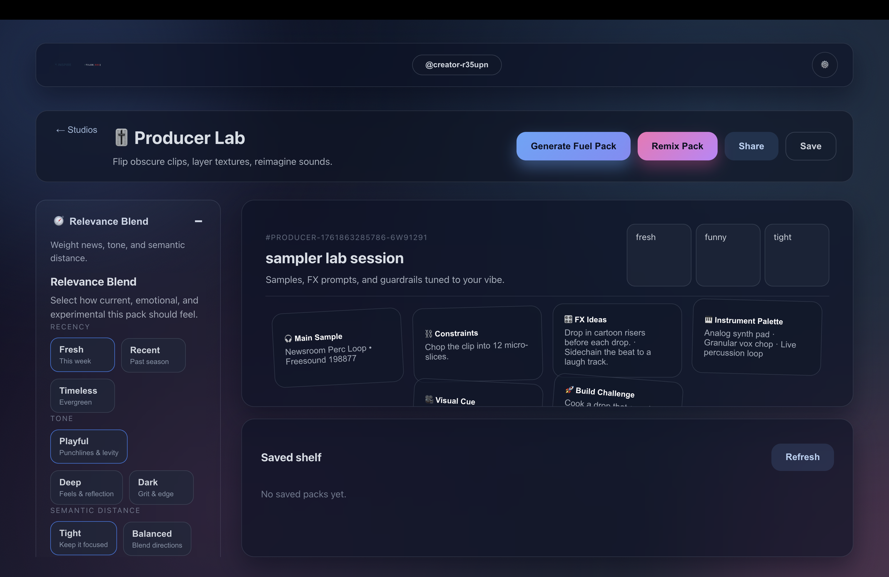

# Inspire




## What Is Inspire?

Inspire is a full-stack TypeScript studio that blends live cultural signals with curated randomness to help musicians and creators break creative blocks. Every "fuel pack" assembles words, samples, visuals, and challenges from real-time APIs so you can start writing, producing, or editing without staring at a blank page.

## Who It's For

- Vocalists who need story sparks, rhyme families, and melodic prompts.
- Producers hunting for royalty-friendly samples, FX ideas, and sonic constraints.
- Editors crafting clips, memes, or reels and looking for mood boards and pacing cues.
- Creative facilitators running writing rooms, workshops, or classroom sessions.

## How Inspire Works

1. Pick a creative mode (Lyricist, Producer, or Editor) and adjust the relevance blend for tone, recency, and experimentation.
2. The backend fans out to live services like Datamuse, Freesound, Jamendo, Piped (YouTube proxy), Unsplash, Imgflip, and NewsAPI to collect the freshest material.
3. Inspire builds a fuel pack with power words, meme-ready visuals, news hooks, sample choices, FX prompts, emotional arcs, and timeline beats so you can ship ideas fast.

## Feature Highlights

- Live news hooks with contextual writing prompts pulled from NewsAPI searches every generation.
- Producer packs combine Freesound samples, Jamendo tracks, and Creative Commons instrumentals from Piped search results.
- Meme tools surface trending templates via Imgflip and let you caption them on demand for shareable drafts.
- Word explorer exposes Datamuse filters for rhymes, syllable counts, and starting letters directly in the interface.
- Theme-aware UI with collapsible workbench controls so you can focus on the content that matters.

## Live Data Sources

| Capability | Provider(s) | Env variables |
| --- | --- | --- |
| Power words, rhymes, syllable filters | Datamuse | none |
| Random vocabulary | Random Word API | none |
| Definitions | Free Dictionary API | none |
| Meme templates and captions | Imgflip | `IMGFLIP_USERNAME`, `IMGFLIP_PASSWORD` |
| Inspirational photography | Unsplash | `UNSPLASH_ACCESS_KEY` |
| Trending memes & reddit topics | Reddit JSON | none |
| Audio samples & sound design | Freesound | `FREESOUND_API_KEY` |
| Royalty-free reference tracks | Jamendo | `JAMENDO_CLIENT_ID` |
| Creative Commons instrumentals | Piped (YouTube proxy) | none |
| News headlines & context | NewsAPI | `NEWS_API_KEY` |

## Project Tour

```
Inspire/
├── backend/
│   ├── src/
│   │   ├── index.ts               # Express server & API routes
│   │   ├── modePackGenerator.ts   # Mode-specific pack assembly (async)
│   │   ├── services/
│   │   │   ├── audioService.ts    # Freesound & Jamendo
│   │   │   ├── memeService.ts     # Imgflip, Unsplash, Reddit
│   │   │   ├── trendService.ts    # NewsAPI & Reddit trends
│   │   │   ├── wordService.ts     # Datamuse & word utilities
│   │   │   ├── youtubeService.ts  # Piped instrumentals
│   │   │   └── apiClient.ts       # Shared axios wrapper
│   │   └── utils/                 # Helpers (ID generation, etc.)
│   ├── package.json
│   └── tsconfig.json
├── frontend/
│   ├── src/
│   │   ├── App.tsx                # Primary UI & orchestration
│   │   ├── components/            # Sliders, collapsible sections, etc.
│   │   └── assets/                # Logos and theme art
│   ├── vite.config.ts             # Dev proxy for /dev and API routes
│   └── package.json
├── docs/                          # Product specs and research notes
└── run_dev.sh                     # Dual-serve script for local dev
```

## Getting Started

### Prerequisites

- Node.js 20+
- npm 10+
- API keys for Unsplash, Freesound, Jamendo, NewsAPI, and Imgflip (username + password) to unlock live data.

### Configure Environment Variables

`backend/.env.example` documents every supported key. Create your local file and populate the secrets before starting the servers.

```bash
cd backend
cp .env.example .env
# Then edit .env and provide the values listed below
```

Required keys for live mode:

```env
FREESOUND_API_KEY=your_freesound_key
JAMENDO_CLIENT_ID=your_jamendo_client_id
UNSPLASH_ACCESS_KEY=your_unsplash_access_key
NEWS_API_KEY=your_news_api_key
IMGFLIP_USERNAME=your_imgflip_username
IMGFLIP_PASSWORD=your_imgflip_password
USE_MOCK_FALLBACK=false
```

Optional keys:

```env
HUGGINGFACE_API_KEY=...
RANDOM_WORD_API_URL=...
PIPED_API_URL=https://piped.video/api/v1
```

### Install Dependencies

```bash
# From the repository root
npm install
(cd backend && npm install)
(cd frontend && npm install)
```

### Run The Stack Locally

Use the bundled helper script to launch both servers with one command.

```bash
./run_dev.sh
```

- Backend runs on `http://localhost:3001`
- Frontend runs on `http://localhost:8080`
- Vite proxies `/dev/api/*` requests to the backend so the UI always hits the real services.

Stop the servers with `Ctrl+C`. Nodemon hot-reloads backend changes and Vite hot-updates the React app.

### Useful npm Scripts

```bash
npm run lint            # Run backend lint rules
npm test                # Run backend Jest suite
npm run build           # Build both backend (tsc) and frontend (vite)
```

## Product Walkthrough

1. Land on the studio picker and choose Lyricist, Producer, or Editor.
2. Tune the Relevance Blend controls for timeframe, tone, and experimentation.
3. Generate a pack to receive:
   - Lyricist: power words, rhyme clusters, lyric fragments, meme sounds, live headlines, and story arcs.
   - Producer: BPM/key suggestions, Freesound sample pairings, FX constraints, instrument palettes, and Creative Commons instrumentals.
   - Editor: moodboard clips, audio cues, pacing beats, visual constraints, and share-ready title prompts.
4. Remix packs to merge favorite elements across runs or share them with collaborators using encoded URLs.

## Contributing

Issues and pull requests are welcome. If you are adding a new integration:

1. Provide mock data in `backend/src/mocks/` for offline development.
2. Add a service wrapper under `backend/src/services/` with graceful fallbacks.
3. Extend `createAllServices()` so the integration is globally available.
4. Update docs and the README to reflect new capabilities.

## License

MIT
