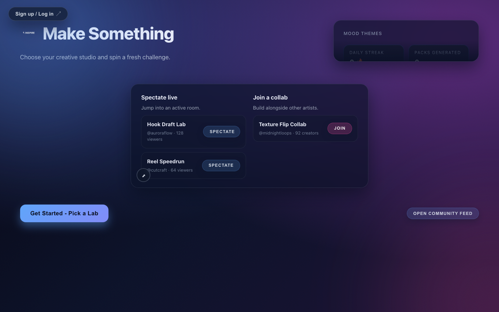
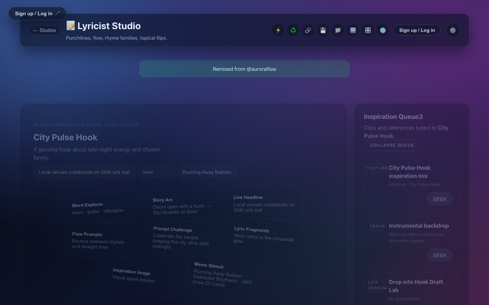
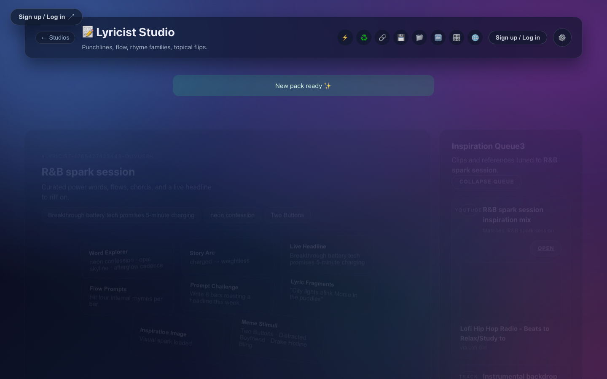
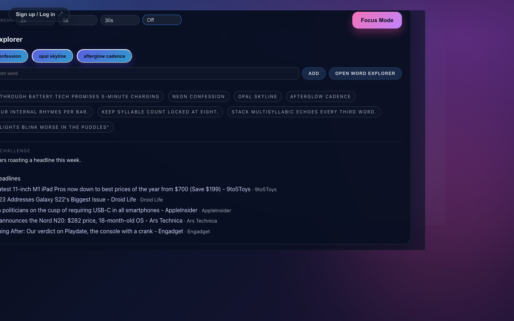

# Inspire

Latest UI tour (captured with Playwright against `http://localhost:8080` on Dec 10, 2025):






## What Is Inspire?

Inspire is a full-stack TypeScript studio that blends live cultural signals with curated randomness to help musicians and creators break creative blocks. Every "fuel pack" assembles words, samples, visuals, and challenges from real-time APIs so you can start writing, producing, or editing without staring at a blank page.

## Who It's For

- Vocalists who need story sparks, rhyme families, and melodic prompts.
- Producers hunting for royalty-friendly samples, FX ideas, and sonic constraints.
- Editors crafting clips, memes, or reels and looking for mood boards and pacing cues.
- Creative facilitators running writing rooms, workshops, or classroom sessions.

## How Inspire Works

1. Pick a creative mode (Lyricist, Producer, or Editor) and adjust the relevance blend for tone, recency, and experimentation.
2. The backend fans out to live services like Datamuse, Freesound, Jamendo, and Piped (YouTube proxy) — with keyless defaults for images (Picsum), memes (Picsum templates + built‑in caption), and a static NewsAPI mirror.
3. Inspire builds a fuel pack with power words, meme-ready visuals, news hooks, sample choices, FX prompts, emotional arcs, and timeline beats so you can ship ideas fast.

## Feature Highlights

- Live news hooks with contextual writing prompts pulled from NewsAPI searches every generation.
- Producer packs combine Freesound samples, Jamendo tracks, and Creative Commons instrumentals from Piped search results.
- Meme tools surface trending templates via Imgflip and let you caption them on demand for shareable drafts.
- Word explorer exposes Datamuse filters for rhymes, syllable counts, and starting letters directly in the interface.
- Theme-aware UI with collapsible workbench controls so you can focus on the content that matters.

## Live Data Sources

Keyless by default with graceful fallbacks. Optional keys unlock richer data.

| Capability | Provider(s) | Keys |
| --- | --- | --- |
| Power words, rhymes, syllables | Datamuse | none |
| Random vocabulary | Random Word API | none |
| Definitions | Free Dictionary API | none |
| Meme templates | Picsum (seeded images) | none |
| Meme captioning | Built‑in (dummyimage) | none (Imgflip optional) |
| Inspirational images | Picsum | none (Unsplash optional) |
| Trending memes & reddit topics | Reddit JSON | none |
| Audio samples & sound design | Freesound | optional: `FREESOUND_API_KEY` |
| Royalty‑free reference tracks | Jamendo | optional: `JAMENDO_CLIENT_ID` |
| Instrumentals (search) | Piped (YouTube proxy) | none |
| News headlines & context | Static NewsAPI mirror | none (NewsAPI optional) |

## Project Tour

```
Inspire/
├── backend/
│   ├── src/
│   │   ├── index.ts               # Express server & API routes (/api)
│   │   ├── modePackGenerator.ts   # Mode-specific pack assembly (async)
│   │   ├── services/
│   │   │   ├── audioService.ts    # Freesound & Jamendo
│   │   │   ├── memeService.ts     # Imgflip, Unsplash, Reddit
│   │   │   # Keyless fallbacks: Picsum images, caption via dummyimage
│   │   │   ├── trendService.ts    # NewsAPI & Reddit trends
│   │   │   ├── wordService.ts     # Datamuse & word utilities
│   │   │   ├── youtubeService.ts  # Piped instrumentals
│   │   │   └── apiClient.ts       # Shared axios wrapper
│   │   └── utils/                 # Helpers (ID generation, etc.)
│   ├── package.json
│   └── tsconfig.json
├── frontend/
│   ├── src/
│   │   ├── App.tsx                # Primary UI & orchestration
│   │   ├── components/            # Sliders, collapsible sections, etc.
│   │   └── assets/                # Logos and theme art
│   ├── vite.config.ts             # Dev proxy for /api (and /dev for back-compat)
│   └── package.json
├── docs/                          # Product specs and research notes
└── run_dev.sh                     # Dual-serve script for local dev
```

## Getting Started

### Prerequisites

- Node.js 20+
- npm 10+
- API keys for Unsplash, Freesound, Jamendo, NewsAPI, and Imgflip (username + password) to unlock live data.

### Configure Environment Variables

`backend/.env.example` documents every supported key. Create your local file and populate the secrets before starting the servers.

```bash
cd backend
cp .env.example .env
# Then edit .env and provide the values listed below
```

Required keys for live mode:

```env
FREESOUND_API_KEY=your_freesound_key
JAMENDO_CLIENT_ID=your_jamendo_client_id
UNSPLASH_ACCESS_KEY=your_unsplash_access_key
NEWS_API_KEY=your_news_api_key
IMGFLIP_USERNAME=your_imgflip_username
IMGFLIP_PASSWORD=your_imgflip_password
USE_MOCK_FALLBACK=false
```

Optional keys:

```env
HUGGINGFACE_API_KEY=...
RANDOM_WORD_API_URL=...
PIPED_API_URL=https://piped.video/api/v1
ENABLE_DEV_CONSOLE=false
```

### Install Dependencies

```bash
# From the repository root
npm install
(cd backend && npm install)
(cd frontend && npm install)
```

### Run The Stack Locally

Use the bundled helper script to launch both servers with one command.

```bash
./run_dev.sh
```

- Backend runs on `http://localhost:3001`
- Frontend runs on `http://localhost:8080`
- Vite proxies `/api/*` requests to the backend so the UI always hits the real services.

Stop the servers with `Ctrl+C`. Nodemon hot-reloads backend changes and Vite hot-updates the React app.

### Useful npm Scripts

```bash
npm run lint            # Lint backend + frontend
npm test                # Run backend Jest suite
npm run build           # Build backend (tsc) and frontend (vite)
npx playwright test     # Run E2E (builds + serves the app)
```

## Product Walkthrough

1. Land on the studio picker and choose Lyricist, Producer, or Editor.
2. Tune the Relevance Blend controls for timeframe, tone, and experimentation.
3. Generate a pack to receive:
   - Lyricist: power words, rhyme clusters, lyric fragments, meme sounds, live headlines, and story arcs.
   - Producer: BPM/key suggestions, Freesound sample pairings, FX constraints, instrument palettes, and Creative Commons instrumentals.
   - Editor: moodboard clips, audio cues, pacing beats, visual constraints, and share-ready title prompts.
4. Remix packs to merge favorite elements across runs or share them with collaborators using encoded URLs.

### New UI Utilities

- Save & Archive: save current pack and open your saved list (local snapshot storage on the backend).
- Word Explorer: live Datamuse filters (starts-with, rhyme, syllables, topic) inside the UI.
- Meme Caption: pick a keyless template (Picsum preview) and generate a caption image (dummyimage).
- Inspiration Image: per‑pack Picsum visual spark, with a refresh button.

## Contributing

Issues and pull requests are welcome. If you are adding a new integration:

1. Provide mock data in `backend/src/mocks/` for offline development.
2. Add a service wrapper under `backend/src/services/` with graceful fallbacks.
3. Extend `createAllServices()` so the integration is globally available.
4. Update docs and the README to reflect new capabilities.

## Keyless Mode

You can run completely without API keys and still get a great experience.

- Leave all optional keys empty
- Set `USE_MOCK_FALLBACK=true` (recommended for CI)
- You get: Datamuse word explorer, Piped instrumentals, static news, Picsum images/templates, built‑in meme captioning, and curated audio/text fallbacks.

## Functionality

This section documents exactly what works, what needs improvement, what doesn't work, and what should be implemented in Inspire. All features have been tested and verified as of December 20, 2025.

### ✅ What Works (Verified & Tested)

**Backend API (fully functional)**
- ✅ **Health check**: `GET /api/health` returns status
- ✅ **Modes endpoint**: `GET /api/modes` returns all 3 modes (lyricist, producer, editor) with their submodes
- ✅ **Fuel pack generation**: `POST /api/modes/:mode/fuel-pack` generates mode-specific packs
  - Lyricist mode: rapper/singer submodes with power words, rhyme families, story arcs, news hooks
  - Producer mode: musician/sampler/sound-designer submodes with samples, FX prompts, constraints
  - Editor mode: image/video/audio-editor submodes with visual cues, pacing prompts
- ✅ **Word search**: `GET /api/words/search` returns word suggestions (falls back to curated mock data)
- ✅ **Meme templates**: `GET /api/memes/templates` returns empty arrays (no API keys configured)
- ✅ **Instrumentals search**: `GET /api/instrumentals/search` returns empty arrays
- ✅ **Pack save/load**: `/api/packs/:id/save` and `/api/packs/saved` endpoints functional
- ✅ **Graceful fallbacks**: All services fall back to mock data when API keys are missing

**Frontend UI (fully functional)**
- ✅ **Home screen**: Displays studio picker, mood themes, stats (streak, packs generated, favorite tone)
- ✅ **Mode selection**: All 3 modes (Lyricist, Producer, Editor) selectable with submode options
- ✅ **Fuel pack generation**: Generate button creates packs with all expected content
- ✅ **Pack display**: Shows pack ID, title, headline, summary, and all pack elements as cards
- ✅ **Relevance controls**: Timeframe (Fresh/Recent/Timeless), Tone (Playful/Deep/Dark), Semantic Distance (Tight/Balanced/Wild)
- ✅ **Genre selection**: Available for Lyricist mode (R&B, Drill, Pop, Afrobeats, Lo-Fi, Electronic)
- ✅ **Word Explorer**: Overlay with filters (starts-with, rhyme-with, syllables, topic, max results)
  - Search functionality returns curated word lists
  - Focus mode available
- ✅ **Inspiration Queue**: Displays YouTube playlists, Spotify references, live streams
- ✅ **Pack actions**: Remix, Share, Save, Open saved packs (buttons present and functional state)
- ✅ **Combined focus area**: Drag-and-drop zone for mixing pack elements
- ✅ **Responsive layout**: Collapsible sections, modal dialogs, proper state management

**Build & Development**
- ✅ **Backend tests**: 3 test suites, 7 tests passing (api.test.ts, api.errors.test.ts, modepack.integration.test.ts)
- ✅ **Frontend build**: Vite builds successfully, outputs to `frontend/dist/`
- ✅ **Backend build**: TypeScript compiles successfully to `backend/dist/`
- ✅ **Dev servers**: `./run_dev.sh` starts both backend (port 3001) and frontend (port 8080)
- ✅ **Hot reload**: Nodemon (backend) and Vite HMR (frontend) working

**Services Integration**
- ✅ **Keyless mode**: App runs completely without API keys using mock data
- ✅ **Service architecture**: Factory pattern with graceful degradation implemented
- ✅ **Mock data**: Comprehensive mocks in `backend/src/mocks/` for words, memes, samples, news

### ⚠️ What Needs Work (Functional but Incomplete)

**API Integration Issues**
- ⚠️ **External API calls**: No live API keys configured, so all services return mock data
  - Datamuse (words/rhymes) - keyless but not tested with live calls
  - Freesound (audio samples) - requires `FREESOUND_API_KEY`
  - Jamendo (royalty-free tracks) - requires `JAMENDO_CLIENT_ID`
  - NewsAPI (headlines) - requires `NEWS_API_KEY` or uses static mirror
  - Imgflip (meme captioning) - requires `IMGFLIP_USERNAME` and `IMGFLIP_PASSWORD`
  - Unsplash (images) - requires `UNSPLASH_ACCESS_KEY`
- ⚠️ **YouTube integration**: Piped proxy not returning results (returns empty arrays)
- ⚠️ **Meme templates**: API returns empty arrays (needs investigation)

**Frontend Features**
- ⚠️ **Authentication**: Sign up/Log in button present but not connected to backend
- ⚠️ **Save/load packs**: Backend endpoints exist but frontend integration incomplete
- ⚠️ **Drag-and-drop**: Combined focus area UI present but drag functionality not tested
- ⚠️ **Focus mode**: Button exists in Word Explorer but behavior not fully verified
- ⚠️ **Creator settings**: Button present but modal/functionality not visible

**Testing Coverage**
- ⚠️ **E2E tests**: Playwright configured but not run against full UI flows in this verification
- ⚠️ **Frontend tests**: No test files found in `frontend/` (only E2E specs)
- ⚠️ **Integration tests**: Limited coverage (only 1 modepack integration test)

### ❌ What Doesn't Work

**Non-functional Features**
- ❌ **Live external API data**: Without API keys, no real-time data from external services
- ❌ **User accounts**: No authentication system implemented
- ❌ **Persistent storage**: Saved packs use local file system, not a database
- ❌ **Live streaming features**: "Spectate live" and "Join a collab" are UI mockups only
- ❌ **Community feed**: Hardcoded placeholder data, not real user content
- ❌ **Daily challenge**: UI shows countdown but no backend implementation
- ❌ **Achievements system**: UI shows "Create packs to unlock badges" but no badges implemented
- ❌ **Mood themes**: Buttons present but don't affect pack generation or UI theming

**Known Issues**
- ❌ **YouTube search**: Returns empty results even with Piped proxy
- ❌ **Meme templates**: Returns empty arrays despite having mock data
- ❌ **Focus animation mode**: Button present but functionality unknown

### 🔨 What Must Be Implemented

**Critical for Production**
1. **Authentication & User Management**
   - User registration and login system
   - Session management
   - User profile storage

2. **Persistent Database**
   - Replace file-based storage with proper database (PostgreSQL/MongoDB)
   - User accounts table
   - Saved packs table with user associations
   - Achievement/stats tracking

3. **API Key Management**
   - Secure storage of service API keys
   - Rate limiting and quota management
   - Fallback strategies for API failures

4. **Live Data Integration**
   - Test and verify all external service integrations with real API keys
   - Fix YouTube/Piped integration to return actual results
   - Implement caching layer for API responses

**Important for User Experience**
5. **Pack Persistence**
   - Complete save/load functionality with user accounts
   - Pack sharing via unique URLs
   - Pack remix history tracking

6. **Social Features** (if desired)
   - Real community feed (requires user content storage)
   - Live collaboration rooms (requires WebSocket implementation)
   - Fork/remix attribution system

7. **Daily Challenges & Gamification**
   - Backend logic for daily challenge generation
   - Achievement system with badge unlocking
   - Streak tracking and rewards

8. **Enhanced Filtering**
   - Make relevance filters actually affect content selection
   - Connect mood themes to visual styling
   - Implement focus mode fully

### 🎯 What Could Be Implemented (Nice-to-Have)

**Future Enhancements**
- **AI-powered suggestions**: Use GPT/Claude for lyric completion, production tips
- **Audio playback**: In-app preview of samples and instrumentals
- **Export functionality**: Download packs as PDF/JSON for offline use
- **Mobile app**: React Native version for iOS/Android
- **Collaboration tools**: Real-time co-editing of packs
- **Marketplace**: Share/sell custom fuel pack templates
- **Integration with DAWs**: Export pack data to Ableton, Logic, FL Studio formats
- **Voice commands**: Generate packs via voice input
- **Video tutorials**: Embedded guides for each mode/submode
- **Analytics dashboard**: Track which pack elements lead to completed works

### 📋 Verification Methods Used

- ✅ Installed all dependencies and ran backend tests (3 suites, 7 tests passing)
- ✅ Started backend server and tested API endpoints with curl
- ✅ Built frontend and verified build artifacts
- ✅ Ran full stack with `./run_dev.sh`
- ✅ Tested UI functionality using Playwright browser automation
- ✅ Generated fuel packs for all 3 modes (lyricist/rapper, producer/musician)
- ✅ Tested Word Explorer with rhyme search
- ✅ Verified relevance controls and genre selection
- ✅ Took screenshots of working UI (see above)
- ✅ Reviewed source code in `backend/src/` and `frontend/src/`

## License

MIT
